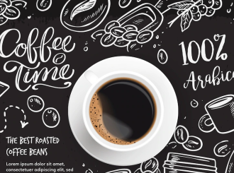

# DNC-Cafeteria
# Criação da Landing Page da cafeteria DNC

# links úteis
Para realizar esse projeto utilizou-se como base para estilização o bootstrap (https://getbootstrap.com/)

# Construção da página

 ---- BARRA DE NAVEGAÇÃO
 
Na barra de navegador foi utilizado um código pré existente no bootStrap que pré organiza o navegador conforme necessário. Segue abaixo o código utilizado. 
No código pré existente, foi inserido o trecho com a Logo do 'DNC Café' dentro da tag 'a', o que odificou o código em relação ao que foi obtido no BootStrap.

      <nav class="navbar navbar-expand-lg bg-body-white">
              

                  
                <button class="navbar-toggler " type="button" data-bs-toggle="collapse" data-bs-target="#navbarNavDropdown" aria-controls="navbarNavDropdown" aria-expanded="false" aria-label="Toggle navigation">
                  
                </button>
                

                  <ul class="navbar-nav">
                    <li class="nav-item">
                      <a class="nav-link active" aria-current="page" href="#">Home</a>
                    </li>
                    <li class="nav-item">
                      <a class="nav-link" href="#">Features</a>
                    </li>
                    <li class="nav-item">
                      <a class="nav-link" href="#">Pricing</a>
                    </li>
                  </ul>
                  <button type="button" class="btn btn-light ms-auto rounded-pill">Fazer Pedido</button>
                

              

            </nav>
 ---- PARTE PRINCIPAL DO SITE
 
 Nessa parte, optou-se por utilizar a tag 'main' e dividi-la em divs conforme necessidade.
 
    <main class="bg-light mb-3">
            

                
            

            

                

                    

                        

                            
                            

                              
Nossa loja de café se encontra em um lugar, 100% fictício, porém caso se sinta interessado pode vir tomar um café conosco em nossa sede em São José dos Campos.

                            

                          

                          

                            
                            

                              
Nossa casa de café é a melhor da região, aqui você tem tudo que precisa, uma boa conversar, bons amigos e um ambiente sem igual. Aproveite, pois Melhor que a DNC não existe!

                            

                          

                          

                            
                            

                              
Por que a DNC? Porque podem contar sempre com um serviço genuíno, uma atmosfera acolhedora e uma incrível xícara de café, torrado por especialistas e preparado de forma enriquecedora.

                            

                          

                          

                            
                            

                              
A escola especialista em formar talentos, com foco em empregabilidade, migração de carreira e aumento de performance.

                            

                          

                    

                  

            

          </main>
 
 A primeira div recebeu somente a imagem que ocupa a tela inteira 
 
            

                  
            

            
 
 
 A segunda div recebeu todas as divs relacionadas aos cards:
 
             

                

                    

                        

                            
                            

                              
Nossa loja de café se encontra em um lugar, 100% fictício, porém caso se sinta interessado pode vir tomar um café conosco em nossa sede em São José dos Campos.

                            

                          

                          

                            
                            

                              
Nossa casa de café é a melhor da região, aqui você tem tudo que precisa, uma boa conversar, bons amigos e um ambiente sem igual. Aproveite, pois Melhor que a DNC não existe!

                            

                          

                          

                            
                            

                              
Por que a DNC? Porque podem contar sempre com um serviço genuíno, uma atmosfera acolhedora e uma incrível xícara de café, torrado por especialistas e preparado de forma enriquecedora.

                            

                          

                          

                            
                            

                              
A escola especialista em formar talentos, com foco em empregabilidade, migração de carreira e aumento de performance.

                            

                          

                    

                  

            

 
 

